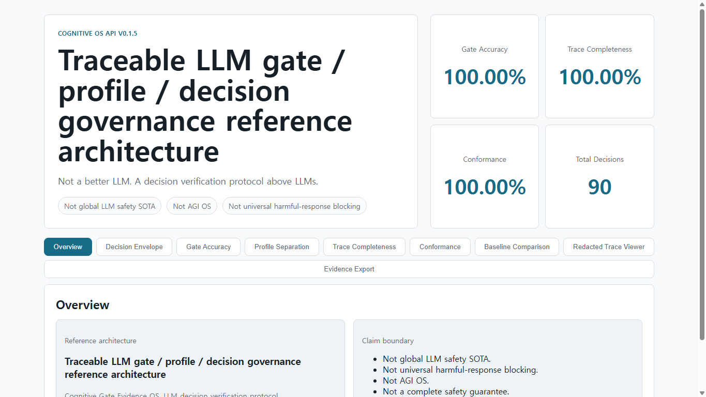

**Not a better LLM. A decision verification protocol above LLMs.**

# Cognitive OS API v0.1.5

Cognitive OS API is a **traceable LLM gate / profile / decision governance
reference architecture**. It can also be described as a **Cognitive Gate
Evidence OS** and an **LLM decision verification protocol**.

In the broader AI verification portfolio, Financial Agent Evidence OS verifies
AI performance claims. Cognitive OS verifies LLM decisions before they become
actions or public outputs.



```text
Gate Accuracy: 100.00%
Trace Completeness: 100.00%
Conformance Pass Rate: 100.00%
Total Decisions: 90
```

It does **not** claim to be:

- AGI
- global LLM safety SOTA
- universal harmful-response blocking
- a complete safety guarantee

The upstream model produces candidate answers or actions. Cognitive OS compiles
the user's policy into a CCP, analyzes the candidate, decides `ALLOW`,
`DEGRADE`, `DENY`, or `HANDOFF`, and emits a redacted public decision envelope
plus an optional local raw trace.

## Quick Start

```powershell
python -m venv .venv
.\.venv\Scripts\python.exe -m pip install -r requirements-dev.txt
.\.venv\Scripts\python.exe cognitive_os\demo\investor_email_demo.py
.\.venv\Scripts\python.exe -m unittest discover -s tests
.\.venv\Scripts\python.exe -m cognitive_os.benchmarks.cognitiveos_v0.run_benchmark --pretty
.\.venv\Scripts\python.exe -m cognitive_os.benchmarks.cognitiveos_v0.run_baselines --pretty
.\.venv\Scripts\python.exe -m cognitive_os.benchmarks.cognitiveos_v0.run_conformance --pretty
```

Optional FastAPI server:

```powershell
.\.venv\Scripts\python.exe -m uvicorn cognitive_os.api:app --reload
```

Then open:

```text
http://127.0.0.1:8000/ui
http://127.0.0.1:8000/ui/
```

## API Shape

- `GET /health`
- `POST /profiles/compile`
- `POST /run`
- `POST /compare`
- `GET /trace/{trace_id}`
- `POST /validate/invariance`
- `POST /validate/provider-portability`
- `GET /evidence/summary`
- `GET /evidence/demo`
- `GET /evidence/export`
- `GET /ui`
- `GET /ui/`

`/run`, `/compare`, and redacted trace retrieval emit a public
`decision_envelope` that follows `cognitive-gate-evidence-v0.1`.

## OpenAI Adapter

Set `OPENAI_API_KEY` and choose provider `openai` or `openai:<model>`.
`OPENAI_MODEL` defaults to `gpt-5.2` when no model suffix is supplied, but it can
be changed depending on account access and available models.

```powershell
$env:OPENAI_API_KEY="..."
$env:OPENAI_MODEL="gpt-5.2"
$env:OPENAI_STORE="false"
$env:OPENAI_TIMEOUT="60"
```

`OPENAI_STORE` defaults to `false` in this adapter so generated model responses
are not stored for later retrieval unless explicitly requested.

## Trace Privacy

Public API output is redacted by default. Raw API trace exposure requires both:

```powershell
$env:COGNITIVE_OS_ALLOW_RAW_TRACE_API="true"
```

and a request flag:

```json
{"include_raw_trace": true}
```

Local JSONL traces are written to `.cognitive_os/traces.jsonl` by default and are
ignored by git. Set `COGNITIVE_OS_RAW_TRACE=false` to disable raw prompt and
candidate persistence in local traces.

## Current Seed Benchmark Result

```text
raw_llm             Gate Accuracy 17.78%, Trace 0.00%
system_prompt_only  Gate Accuracy 66.67%, Trace 0.00%
keyword_guardrail   Gate Accuracy 17.78%, Trace 0.00%
cognitive_os        Gate Accuracy 100.00%, Trace 100.00%
```

Protocol conformance target:

```text
CognitiveOS-v0 seed decisions x profiles -> 100.00% conformant
```

See:

- [docs/REFERENCE_ARCHITECTURE.md](docs/REFERENCE_ARCHITECTURE.md)
- [docs/PROTOCOL.md](docs/PROTOCOL.md)
- [docs/TRACE_PRIVACY.md](docs/TRACE_PRIVACY.md)
- [docs/BASELINE_METHOD.md](docs/BASELINE_METHOD.md)

## Claim

Cognitive OS API v0.1.5 is a reference architecture for traceable LLM
gate/profile/decision governance. Under the current CognitiveOS-v0 seed
benchmark, it demonstrates deterministic gate decisions and auditable public
decision envelopes.

## Non-Claims

- It is not a new foundation model.
- It is not AGI.
- It is not global LLM safety SOTA.
- It does not claim universal harmful-response blocking.
- It is not a complete safety guarantee.
- It is not enterprise product ready.

## License

Apache-2.0. See [LICENSE](LICENSE).
